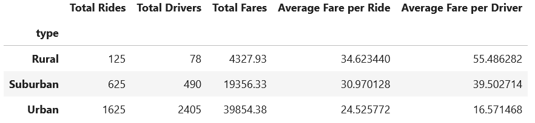
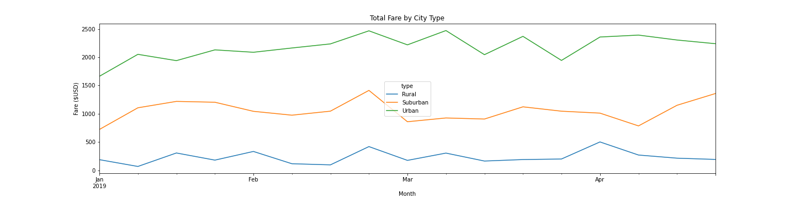

# PyBer_Analysis
Analysis of ride-sharing data by city type using pandas and matplotlib libraries

## Bacground: 
Customer's guidance:
* Using your Python and Pandas, you’ll create a summary DataFrame of the ride-sharing data by city type. 
* Then, using Pandas and Matplotlib, you’ll create a multiple-line graph that shows the total weekly fares for each city type.
* Finally, create a written report that summarizes how the data differs by city type and how those differences can be used by decision-makers at PyBer.

## Results:

## Observations of Summary Table

## Summary:
There are fewer rural riders and drivers compared to urban. This indicates that those that live in urban areas have greater access to Pyber services.